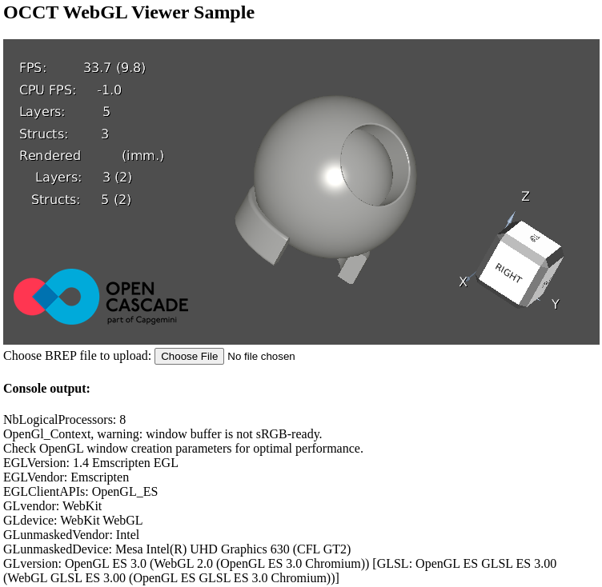

# model-webviewer-ci
ci to build a 3d model viewer for the web

## Usage
1. Grab a [www.zip file](https://github.com/greyltc/model-webviewer-ci/releases/latest/download/www.zip) from the releases here and extract it someplace
1. Run `python3 -m http.server` wherever you extracted it
1. Use your browser to visit http://localhost:8000/

## Try it out live in your browser now
http://cadview.greyltc.org

## It looks like this

